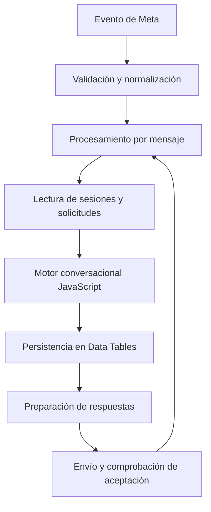

# WhatsApp Service Agent — n8n + Meta

Proyecto de automatización de Edgar Méndez (@MenPar221197), desarrollado dentro de Ragdeops a partir de un caso práctico de atención por WhatsApp. Esta publicación generaliza la implementación y elimina la configuración del negocio original. Desarrollo iterativo con asistencia de herramientas de IA; el motor de esta versión funciona por reglas JavaScript, sin LLM.

## Qué resuelve

Recibe mensajes de WhatsApp, mantiene el estado de una conversación y captura solicitudes de pedidos, reservas, eventos, facturación y atención humana. Las solicitudes requieren revisión del encargado; el bot no cobra, confirma disponibilidad ni emite facturas automáticamente.

## Arquitectura



## Estructura

- `workflows/whatsapp-service-agent.json`: workflow importable, inactivo y sin credenciales.
- `src/conversation.cjs`: motor extraído del nodo, para lectura y pruebas locales.
- `config.example.json`: configuración comercial de ejemplo.
- `tests/conversation.test.cjs`: pruebas de captura, duplicados, fechas y permisos.

El JSON es el artefacto ejecutable de n8n. Al modificar el motor independiente, sincroniza su contenido con el nodo Procesar conversacion antes de importar.

## Instalación

1. Usa una instancia de n8n que incluya WhatsApp Trigger, WhatsApp y Data Tables; verifica compatibilidad con los typeVersion del JSON.
2. Importa el JSON sin activarlo.
3. Selecciona las credenciales de Meta requeridas por Recibir WhatsApp Meta y Enviar por Meta dentro de n8n. No guardes secretos en Git.
4. En Configurar Meta, completa businessPhone con código de país y solo dígitos. managerPhone es opcional y debe ser distinto al número del bot.
5. Crea dos Data Tables: sesiones y solicitudes. Ambas usan columnas de tipo string: Telefono, Cliente, Intencion, Mensaje, Respuesta, Fecha y Estado. Selecciona sesiones en Leer sesion/Guardar sesion y solicitudes en Leer solicitudes/Guardar solicitud.
6. Personaliza el objeto config en Procesar conversacion siguiendo config.example.json. El catálogo, horario y ubicación están vacíos o son ejemplos.
7. Configura el webhook público de Meta para tu instancia y comprueba las suscripciones antes de activar: otra instalación puede compartir la misma app.
8. Envía mensajes desde un número distinto; comprueba ejecuciones, persistencia y entrega real. Configura el encargado antes de probar pendientes, aprobar FOLIO o rechazar FOLIO motivo.

## Pruebas locales

```sh
node --test tests/conversation.test.cjs
```

Ejemplo ficticio: pedido → Ana Ejemplo → 2 porciones de comida → 2030-10-05 → 10:00 → efectivo → sí. Comprueba la creación de una solicitud Pendiente; el encargado decide posteriormente.

## Alcance y pendientes

- Mantiene sesiones y una lista limitada de IDs vistos para reducir duplicados.
- Procesa secuencialmente mensajes de un evento; concurrencia entre ejecuciones y recuperación transaccional pendientes.
- Guarda referencias de adjuntos, sin descarga privada, OCR ni verificación fiscal.
- Requiere comprobar las ventanas de atención de WhatsApp. No incluye plantillas para avisos fuera de ventana.
- Un ID aceptado por Meta no demuestra entrega; los eventos de fallo requieren seguimiento.
- Antes de producción faltan pruebas de integración con credenciales, tablas y números reales. Las pruebas locales no certifican entrega por WhatsApp.
- Se leen todas las solicitudes: para escalar, implementar consultas más acotadas, retención y control de acceso.
- El ejemplo usa fechas y normalización telefónica para México; adapta estas reglas para otros países.

## Publicación y privacidad

Se eliminaron teléfonos, dirección, catálogo, precios, IDs de tablas, referencias a credenciales, datos fijados y metadatos de la instancia original. Configura los datos reales solo en tu instalación privada. La configuración original no se distribuye.
