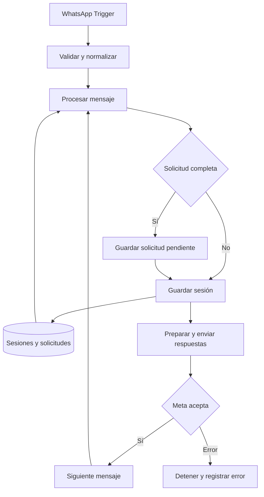

# WhatsApp Business Agent · n8n

[](https://github.com/MenPar221197/whatsapp-service-agent/actions/workflows/validate.yml)

Asistente configurable de atención al cliente por WhatsApp, construido con **n8n, JavaScript, Meta Cloud API y Data Tables**. Recibe mensajes, conserva el estado de la conversación, captura solicitudes y permite que una persona autorizada las apruebe o rechace.

Proyecto de portafolio de **[Edgar Méndez](https://github.com/MenPar221197)**, desarrollado dentro de Ragdeops con asistencia de herramientas de IA. La arquitectura parte de un piloto real y se presenta como una plantilla independiente, sin información del negocio original.

> **Estado: prototipo configurable, validado localmente con datos sintéticos.** La plantilla requiere credenciales, tablas y pruebas de integración en n8n. La conversación usa reglas y estados explícitos; esta versión no incluye un LLM.

**English:** A configurable WhatsApp customer-service workflow with persistent conversation state, request intake, authorized human review, and an explicit delivery-error path. Built with n8n and dependency-free JavaScript.

## Funcionalidades

- Catálogo, horarios y ubicación desde una configuración independiente.
- Formularios para pedidos, citas, cotizaciones, solicitudes de factura y atención humana.
- Confirmación de los datos antes de guardar una solicitud como `Pendiente`.
- Consulta de estado limitada a las solicitudes del número que escribe.
- Comandos del responsable: `pendientes`, `aprobar FOLIO` y `rechazar FOLIO motivo`.
- Historial de IDs recientes para reducir respuestas duplicadas ante reintentos de Meta.
- Validación de remitentes, bloqueo de autoenvíos y división de respuestas largas.
- Registro de referencias de documentos para revisión humana.
- Pruebas locales y validación automática mediante GitHub Actions.

## Arquitectura



El workflow conserva 18 nodos de ejecución y 2 notas de configuración. Los módulos JavaScript se mantienen por separado y se incorporan al JSON mediante un generador reproducible.

| Ruta | Contenido |
| --- | --- |
| [`workflows/whatsapp-service-agent.json`](workflows/whatsapp-service-agent.json) | Workflow completo para importar en n8n |
| [`src/`](src/) | Normalización, conversación, preparación de respuestas y comprobación de aceptación |
| [`config/business.example.json`](config/business.example.json) | Formularios y datos de ejemplo del negocio |
| [`config/workflow-layout.json`](config/workflow-layout.json) | Nodos, conexiones y configuración de la plantilla |
| [`config/data-tables.schema.json`](config/data-tables.schema.json) | Esquema de las dos tablas |
| [`examples/inbound-message.json`](examples/inbound-message.json) | Evento sintético del WhatsApp Trigger |
| [`tests/`](tests/) | Pruebas de conversación, transporte y publicación |
| [`docs/`](docs/) | Instalación, arquitectura y pruebas de integración |

## Inicio rápido

1. Descarga e importa [`workflows/whatsapp-service-agent.json`](workflows/whatsapp-service-agent.json) en n8n mediante **Import from File**.
2. Crea las tablas de sesiones y solicitudes con las columnas descritas en [`docs/SETUP.md`](docs/SETUP.md).
3. Completa el nodo **Configurar negocio** con tus números, IDs de tablas y `businessConfigJson`.
4. Selecciona las credenciales de Meta en **Recibir WhatsApp Meta** y **Enviar por Meta**.
5. Realiza las pruebas de [`docs/TESTING.md`](docs/TESTING.md) antes de activar el flujo.

El número del responsable es opcional y debe ser distinto al número del bot. Los tokens se almacenan en el gestor de credenciales de n8n.

## Desarrollo y validación

Requiere Node.js 22.8 o posterior. Las pruebas y el generador no necesitan dependencias externas ni acceso a Meta.

```bash
git clone https://github.com/MenPar221197/whatsapp-service-agent.git
cd whatsapp-service-agent
npm run build
npm run check
npm test
```

Edita los módulos de `src/`, la configuración pública de ejemplo o el diseño de nodos, y vuelve a generar el workflow con `npm run build`. `npm run check` detecta diferencias entre las fuentes y el JSON publicado.

## Alcance actual

Las solicitudes requieren revisión humana. El flujo no calcula inventario, cobra, emite facturas, descarga documentos ni interpreta imágenes o audios. La aceptación de un mensaje por Meta no demuestra su entrega.

Los avisos usan mensajes de texto y requieren una ventana de atención válida. No hay plantillas aprobadas incluidas, una cola de reintentos ni garantía de procesamiento único entre ejecuciones simultáneas. Estos límites y las siguientes mejoras están descritos en [`docs/ARCHITECTURE.md`](docs/ARCHITECTURE.md).

## Referencias técnicas

- [Credenciales de WhatsApp en n8n](https://docs.n8n.io/integrations/builtin/credentials/whatsapp/)
- [WhatsApp Trigger y uso de un único webhook por app](https://docs.n8n.io/integrations/builtin/trigger-nodes/n8n-nodes-base.whatsapptrigger/)
- [Data Table: operaciones de lectura y escritura](https://docs.n8n.io/integrations/builtin/core-nodes/n8n-nodes-base.datatable/)

WhatsApp, Meta y n8n pertenecen a sus respectivos titulares. Este repositorio documenta una implementación independiente.
